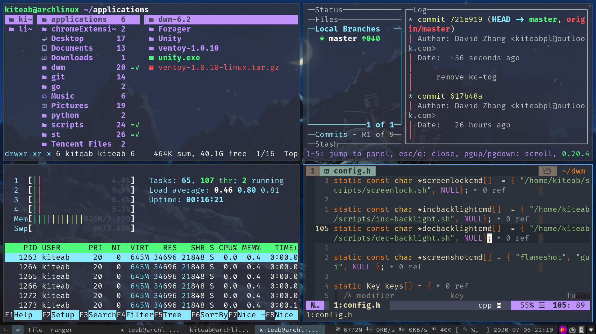

# My .config

#### Hello, there are my config file.

---

#### Effect (dwm and vim):

---

### WARNING: YOU CANNOT COPY AND PASTE MY CONFIG FILE! BUT YOU CAN COPY, EDIT AND PASTE.

Continue, Use your linux!

##### Hint: My system is Arch Linux, if your system is ubuntu or fedora, you maybe can't use this config.

And, please don't put these file to your ~/.config folder, because some folders(eg. .vim) can't apply config if you put these folder(s) to .config folder.

---

WARNING: PLEASE READ THESE CONFIGURATION FILES BEFORE USING MY NVIM OR VIM CONFIGURATION, BECAUSE YOUR MACHINE **DOES NOT NECESSARILYL HAVE THE DEPENDENCIES THAT MY CONFIGUATION FILE NEEDS**!!

---

## My Arch Linux packages

See [my-packages.txt](my-packages.txt)

---

## About my scripts

See [this project](https://github.com/KiteAB/scripts)

---

## About my dynamic window manager

See [this project](https://github.com/KiteAB/dwm)
